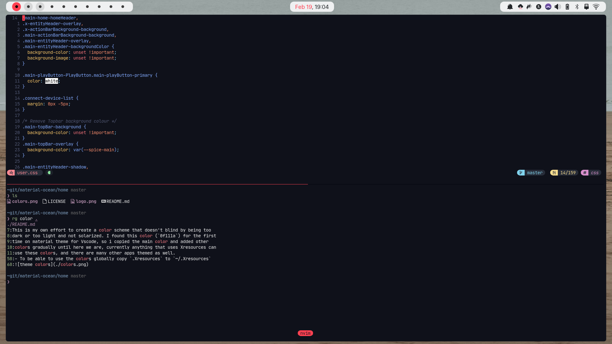

### Requirements

- [JetBrains Mono](https://www.jetbrains.com/lp/mono/)

### Installation

- clone or download this repo
- `cp "Material Ocean.colorscheme" ~/.local/share/konsole/`
- edit your current profile anset colorscheme to Material Ocean

### License:

Licensed Under
[GNU’s GPL version 3](https://github.com/material-ocean/Material-Ocean/blob/master/LICENSE)
